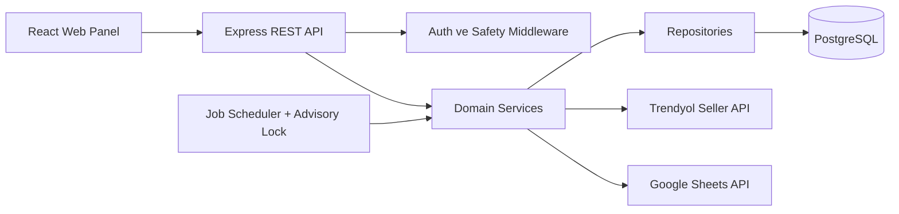
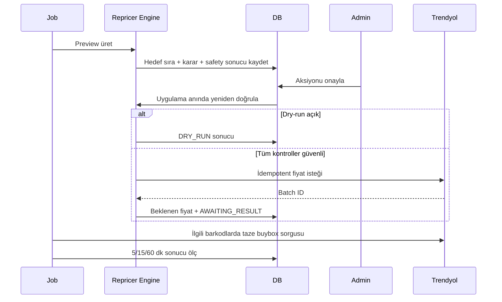

# Mimari

## Genel Yapı

Frontend build'i Express tarafından sunulur; Railway'de tek servis yeterlidir.

## Katmanlar

- `src/domain`: minimum fiyat, net kâr ve repricer kararlarının saf fonksiyonları
- `src/repositories`: parametreli SQL ve veri erişimi
- `src/services`: entegrasyon, transaction, job ve iş akışları
- `src/routes`: HTTP sözleşmesi; SQL ve fiyat iş mantığı içermez
- `src/middleware`: auth, CSRF, CORS, rate limit, security headers ve hata yönetimi
- `src/db`: versioned, transactional migrationlar
- `client`: React/Vite web panel

## Veri Sahipliği

PostgreSQL ürün, ayar, maliyet, buybox, aksiyon, öğrenme ve audit verilerinin tek gerçek kaynağıdır. Google Sheets import/export adaptörüdür. Panel ayarları `product_settings` ve `system_settings` tablolarına yazılır.

## Fiyat Akışı

API kabulünden sonra beklenen fiyat ve geçmiş atomik kaydedilir. Bu değer kesin pazar sonucu sayılmaz; 5/15/60 dakika jobları ilgili barkodların buybox verisini yeniden çekmeden outcome yazmaz.

## Sıra Bazlı Optimizasyon

Repricer önce ekonomik olarak mümkün olan en iyi sırayı arar. Birinci sıra minimum fiyatın altındaysa ikinci, ikinci de mümkün değilse üçüncü sıra hedeflenir. Üst sıraya çıkılamadığında mevcut sıra korunarak bilinen bir sonraki fiyatın hemen altında mümkün olan en yüksek kâr aranır. Tüm artış ve düşüşler ürün/global günlük değişim, maksimum artış ve minimum fiyat sınırlarıyla kademelenir.

## Güvenli Geri Alma

Başarılı bir aksiyon geri alınırken doğrudan API çağrısı yapılmaz. Eski fiyata bağlı `ROLLBACK` aksiyonu oluşturulur; bu kayıt yeniden onaylanır ve uygulama anında tüm safety kontrollerinden geçer. Başarılı gönderimden sonra asıl aksiyon `REVERTED` olarak ilişkilendirilir.

## Google Dayanıklılığı

Tek token cache, exponential backoff, jitter, AbortController timeout ve circuit breaker kullanılır. Sheet okuma/validation bitmeden DB transactionı başlamaz. Mapping ve kural değişimleri temp tablolar üzerinden atomic replace edilir.

## Geriye Uyumluluk

Read-only özet endpointleri korunur. Eski fiyat uygulama GET endpointi kasıtlı olarak `410` döndürür. Mutasyonlar auth + CSRF isteyen POST/PATCH/DELETE endpointlerine taşınmıştır.
