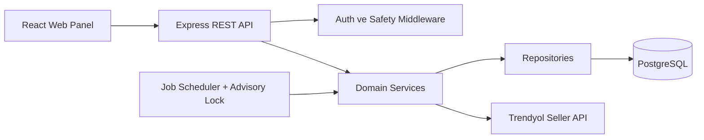
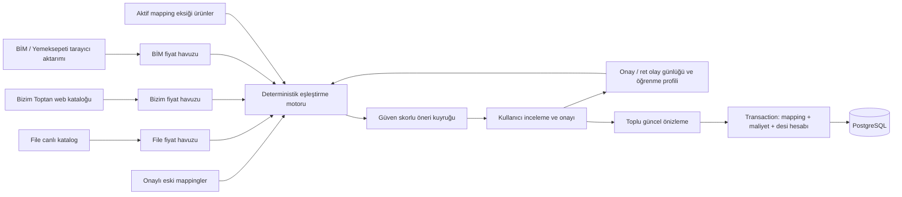

# Mimari

## Genel Yapı



Frontend build'i Express tarafından sunulur; Railway'de tek servis yeterlidir.

## Katmanlar

- `src/domain`: minimum fiyat, net kâr ve repricer kararlarının saf fonksiyonları
- `src/repositories`: parametreli SQL ve veri erişimi
- `src/services`: entegrasyon, transaction, job ve iş akışları
- `src/routes`: HTTP sözleşmesi; SQL ve fiyat iş mantığı içermez
- `src/middleware`: auth, CSRF, CORS, rate limit, security headers ve hata yönetimi
- `src/db`: versioned, transactional migrationlar
- `client`: React/Vite web panel

## Veri Sahipliği

PostgreSQL ürün, ayar, maliyet, buybox, aksiyon, öğrenme ve audit verilerinin tek gerçek kaynağıdır. Trendyol ürün, fiyat, stok ve komisyon verileri Trendyol Seller API üzerinden alınır. Panel ayarları `product_settings` ve `system_settings` tablolarına yazılır.

Para hesapları JavaScript kayan nokta aritmetiğiyle biriktirilmez; tutarlar kuruşa, oranlar ölçekli tam sayıya çevrilip yuvarlanarak hesaplanır. PostgreSQL tarafında parasal alanlar `NUMERIC` olarak saklanır.

## Fiyat Akışı

```mermaid
sequenceDiagram
  participant Job
  participant Engine as Repricer Engine
  participant DB
  participant Admin
  participant TY as Trendyol
  Job->>Engine: Preview üret
  Engine->>DB: Hedef sıra + karar + safety sonucu kaydet
  Admin->>DB: Aksiyonu onayla
  DB->>Engine: Uygulama anında yeniden doğrula
  alt Dry-run açık
    Engine->>DB: DRY_RUN sonucu
  else Tüm kontroller güvenli
    Engine->>TY: Barkodun güncel pazar fiyatını oku
    TY-->>Engine: Gerçek satış fiyatı
    Engine->>Engine: Beklenen eski fiyatla eşleştir
    Engine->>TY: İdempotent fiyat isteği
    TY-->>Engine: Batch ID
    Engine->>DB: AWAITING_RESULT; ürün fiyatını değiştirme
  end
  Job->>TY: Batch item sonucu + güncel ürün fiyatı
  Job->>DB: Doğrulanan fiyatı atomik kesinleştir
  Job->>TY: İlgili barkodlarda taze buybox sorgusu
  Job->>DB: 5/15/60 dk sonucu ölç
```

API kabulü yalnızca batch takip numarasını ve `AWAITING_RESULT` durumunu kaydeder. Ürün fiyatı, kâr alanları, fiyat geçmişi ve rollback ilişkisi; batch item `SUCCESS` olduktan ve Product V2 okuması önerilen fiyatı gerçekten gösterdikten sonra tek transaction içinde kesinleşir. 5/15/60 dakika jobları ayrıca ilgili barkodların buybox verisini yeniden çekmeden outcome yazmaz.

## Sıra Bazlı Optimizasyon

Repricer önce ekonomik olarak mümkün olan en iyi sırayı arar. Birinci sıra minimum fiyatın altındaysa ikinci, ikinci de mümkün değilse üçüncü sıra hedeflenir. Üst sıraya çıkılamadığında mevcut sıra korunarak bilinen bir sonraki fiyatın hemen altında mümkün olan en yüksek kâr aranır. Tüm artış ve düşüşler ayrı tek işlem ve günlük toplam değişim, maksimum artış ve minimum fiyat sınırlarıyla kademelenir.

## Güvenli Geri Alma

Başarılı bir aksiyon geri alınırken doğrudan API çağrısı yapılmaz. Eski fiyata bağlı `ROLLBACK` aksiyonu oluşturulur; bu kayıt yeniden onaylanır ve uygulama anında tüm safety kontrollerinden geçer. Batch ve pazar fiyatı doğrulandıktan sonra asıl aksiyon `REVERTED` olarak ilişkilendirilir.

## Veri Yönetimi

V2 Google Sheets import/export katmanına bağlı değildir. Maliyet kalemi, mapping, kargo ve ambalaj verileri panel API'leriyle PostgreSQL'e yazılır. Toplu işlemler doğrulama ve transaction kullanır; hatalı veri mevcut çalışan kaydı bozmaz.

## Akıllı Mapping Akışı



Eşleştirme motoru ürün adlarını Türkçe karakterlerden bağımsız normalize eder; marka, kategori, hacim/gramaj ve paket adedi sinyallerini ayrı ağırlıklarla değerlendirir. Adaylar tedarikçi havuzu içinde üretilir; farklı havuzlar tek reçetede birleşmez. Her onay ve ret immutable geri bildirim olayına yazılır. Yüksek güven önerisi dahi kendiliğinden uygulanmaz. Onay, önizleme ve uygulama ayrı durumlardır; hedef ürünün hâlâ aktif ve mapping eksik olması, cost code'ların geçerli olması ve kullanılacak tedarikçi fiyatının en fazla 30 günlük olması uygulama anında yeniden denetlenir.

Maliyet kalemleri fiziksel ürünün kesirli birim desisini korur. Nihai ürün desisi `SUM(adet × birim desi)` sonrasında `CEIL` ile yukarı yuvarlanır ve kargo/ambalaj seçimi bu tam sayı üzerinden yapılır.

## Operasyon Kontrolleri

`/health` servis ve DB bağlantısını, `/ready` gerekli migration sürümünü denetler. Bakım modu açıkken ayarlar dışında veri değiştiren yönetim istekleri `503` ile durur; okuma ekranları erişilebilir kalır.

## Geriye Uyumluluk

V2 panel ve `/api/*` REST sözleşmesi ana kullanım yüzeyidir. Eski Google Sheet ve URL komutları V2 runtime yüzeyinden kaldırılmıştır. Mutasyonlar auth + CSRF isteyen POST/PATCH/DELETE endpointleriyle yapılır.
