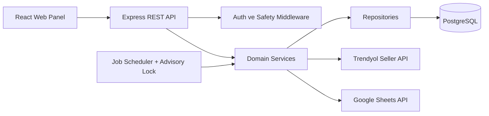
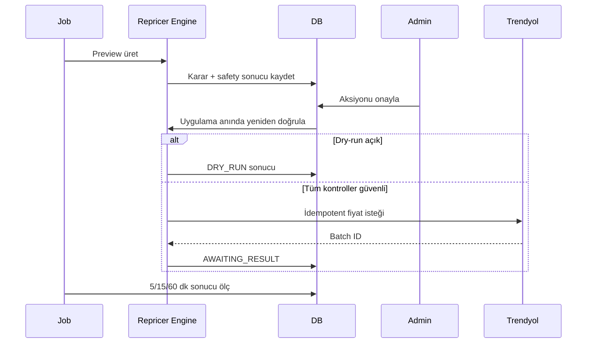

# Mimari

## Genel Yapı

Frontend build'i Express tarafından sunulur; Railway'de tek servis yeterlidir.

## Katmanlar

- `src/domain`: minimum fiyat, net kâr ve repricer kararlarının saf fonksiyonları
- `src/repositories`: parametreli SQL ve veri erişimi
- `src/services`: entegrasyon, transaction, job ve iş akışları
- `src/routes`: HTTP sözleşmesi; SQL ve fiyat iş mantığı içermez
- `src/middleware`: auth, CSRF, CORS, rate limit, security headers ve hata yönetimi
- `src/db`: versioned, transactional migrationlar
- `client`: React/Vite web panel

## Veri Sahipliği

PostgreSQL ürün, ayar, maliyet, buybox, aksiyon, öğrenme ve audit verilerinin tek gerçek kaynağıdır. Google Sheets import/export adaptörüdür. Panel ayarları `product_settings` ve `system_settings` tablolarına yazılır.

## Fiyat Akışı

DB fiyatı gönderim anında kesin gerçek kabul edilmez; sonraki ürün/buybox sync ile doğrulanır.

## Google Dayanıklılığı

Tek token cache, exponential backoff, jitter, AbortController timeout ve circuit breaker kullanılır. Sheet okuma/validation bitmeden DB transactionı başlamaz. Mapping ve kural değişimleri temp tablolar üzerinden atomic replace edilir.

## Geriye Uyumluluk

Read-only özet endpointleri korunur. Eski fiyat uygulama GET endpointi kasıtlı olarak `410` döndürür. Mutasyonlar auth + CSRF isteyen POST/PATCH/DELETE endpointlerine taşınmıştır.
